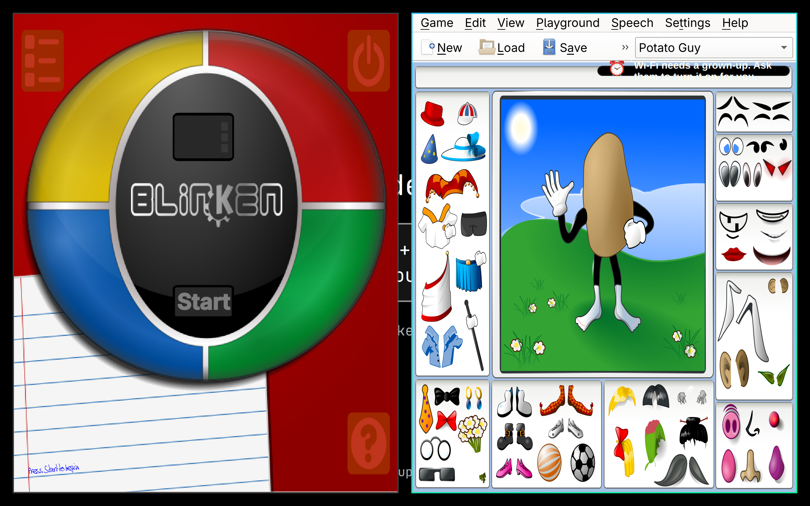

Observed on the real Air with installed source `4d0703f`, package SHA256 `a20feddcca8bd6c07b95fe6580c73cd49129be6585fc6186b7839834ed9660fb`. The approved original screenshot is copied without alteration.

The Wi-Fi refusal toast’s wrapped text extends above and below its background, becoming hard to read over the application. `share/time/toast.qml:31` derives window height from `card.implicitHeight`, but the card Rectangle has no implicit height derived from its content Row. The window therefore stays 32 pixels high and its inset card is shorter still.

Expected: the background contains the full message and icon with padding. Suggested fix: derive the card’s implicit height from the Row’s content height plus vertical padding, and size the window around that card. Deferred; no fix is included in this evidence.

