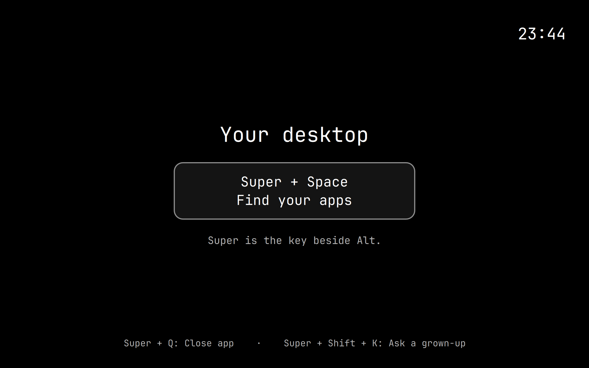
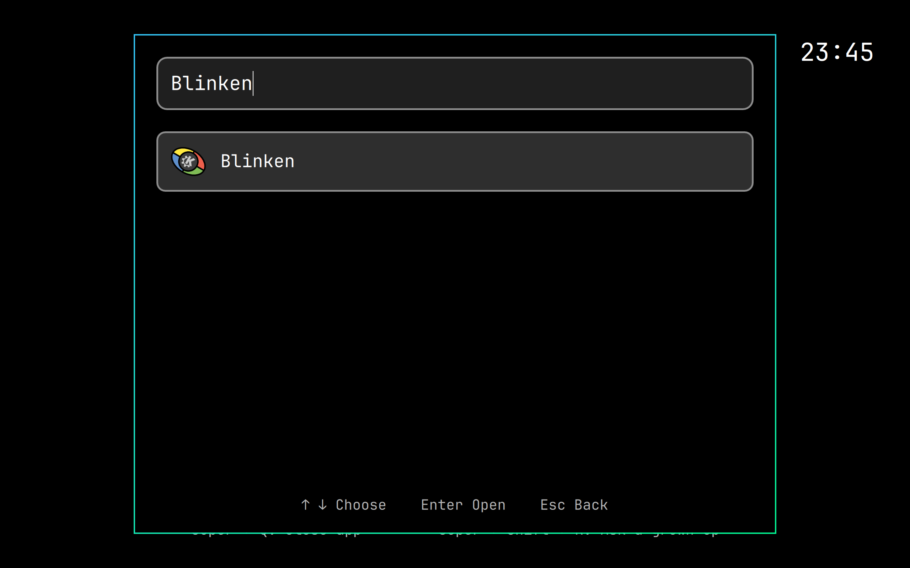
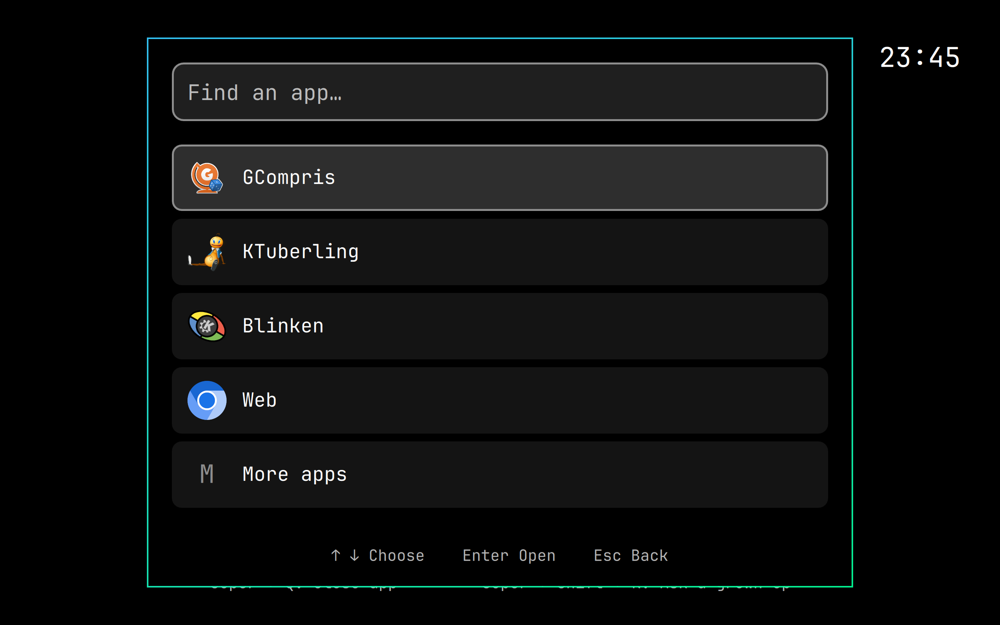
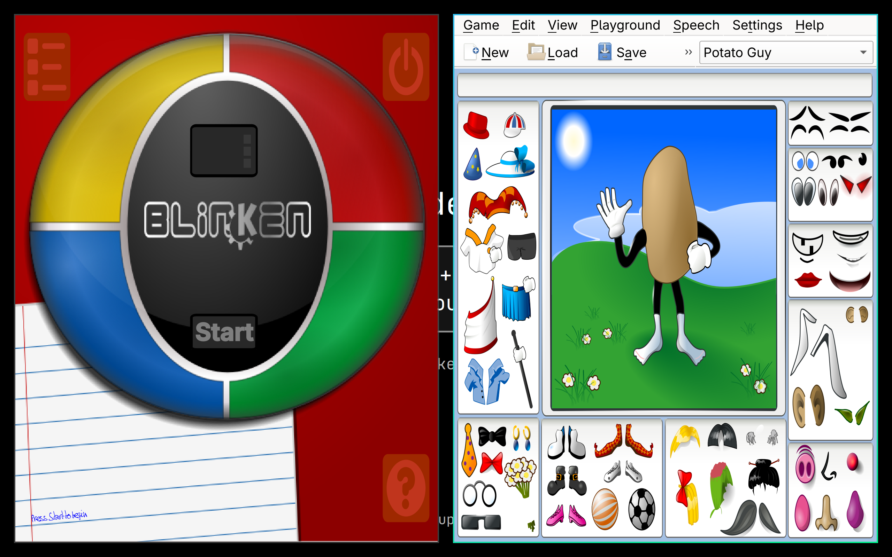
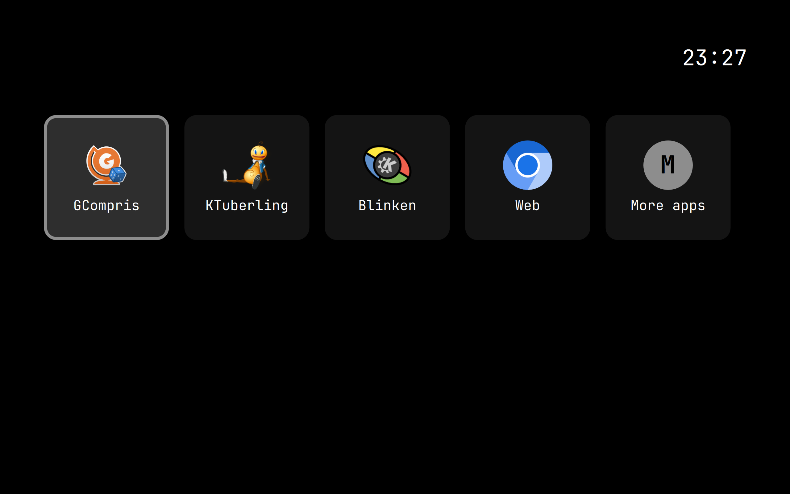
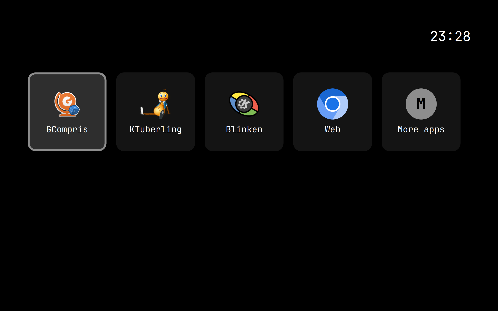
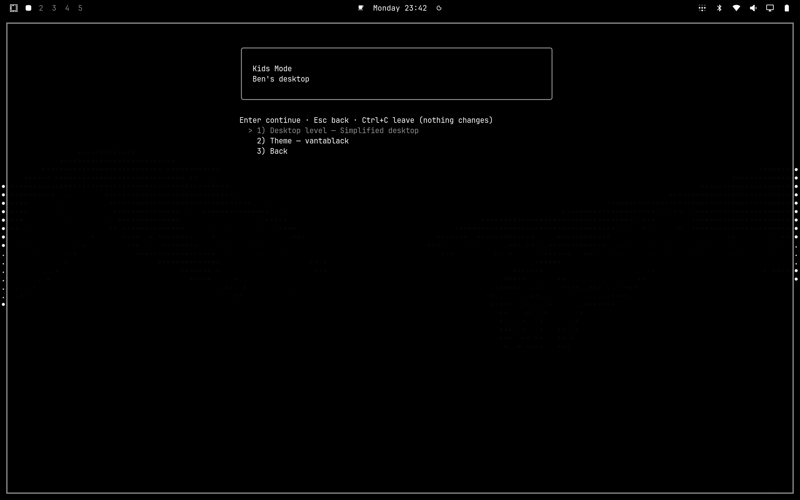

Final #200 desktop-flow evidence from the real Air. Seven approved original PNGs, copied without alteration. Ben is the invented test child.

Installed source `4d0703f`, package SHA256 `a20feddcca8bd6c07b95fe6580c73cd49129be6585fc6186b7839834ed9660fb`. The live pass exercised Simplified desktop search, clearing and reopening the picker, two applications side by side, an App grid session with application return, and restoration of Level 2 through the parent UI.

The synthetic Super+Space check used the existing binding with `input.resolve_binds_by_sym=true` set temporarily in that child session; its original `false` value was restored afterward. This does not establish a physical-keyboard test. The App grid and parent-setting checks used the actual installed UI, not a renderer fixture.

Simplified desktop after fresh login.

Typing Blinken filters the app picker to its matching result.

The picker reopened through the existing Super+Space binding, with the prior search cleared.

Blinken and KTuberling open side by side in Simplified desktop.

A fresh App grid session after choosing Level 1 through the parent controls.

The App grid is visible again after opening and returning from an application.

The parent UI confirms Simplified desktop (Level 2) was restored.

