Actual Air screenshots, September 7, 2026, supporting #197, #200 and #201. These are the approved original PNGs, copied without alteration. Ben is the invented test child.

This gallery records the build represented by source `5c60118`, installed package SHA256 `da086c1a49f6bfe7af54f4919999f9fad2fec7bd318dc7013da7d276e36da06f`. It precedes the later focus fix and package built from `4d0703f`. The live driver identified the original child Quickshell process as PID `1920256`; these screenshots alone do not prove watching or process identity.

The automated Super+Space check activated the real binding only while `input.resolve_binds_by_sym=true` was set temporarily in that child session. The live driver restored its original `false` value afterward. This is evidence for the binding and picker flow under that input setting, not an unmodified synthetic-input check or a physical-keyboard test.

Setup completion, login, app windows, Ask-later submission and return to the portal are recorded below. Screenshots do not prove enforcement, screen-time expiry, approval, Wi-Fi connectivity or boot behavior. No boot verification is claimed.

Youngest-band permissions. The customization summary shows the youngest band’s defaults, including no browser and App grid.

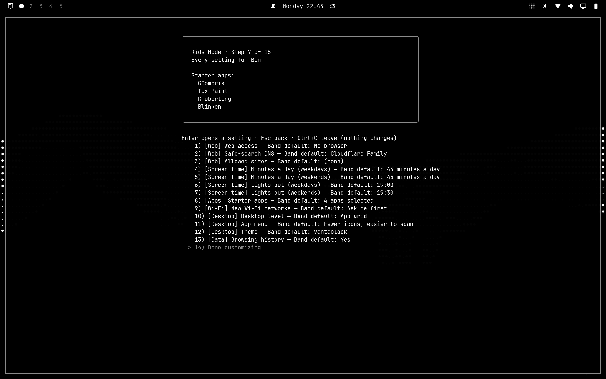

Older-band permissions. The older-band summary shows different web, time, app and desktop defaults.

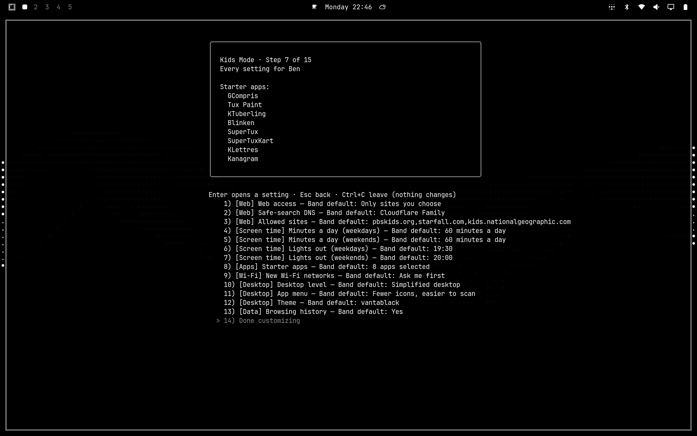

Desktop choice. The wizard offers App grid, Simplified desktop and Full desktop, with their behavior explained.

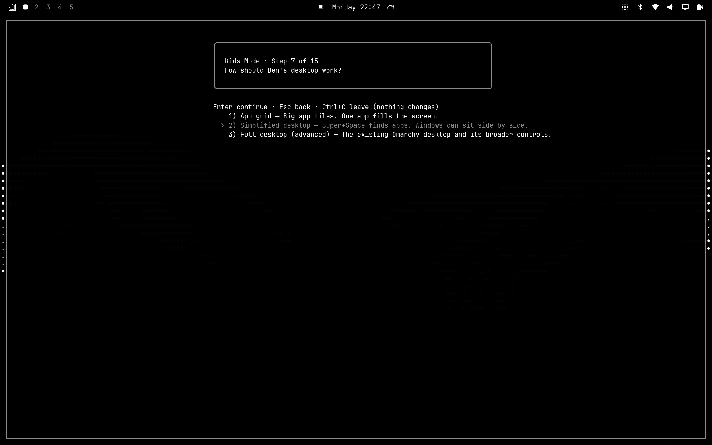

Grid override. The summary labels App grid as a change from the Simplified desktop band default.

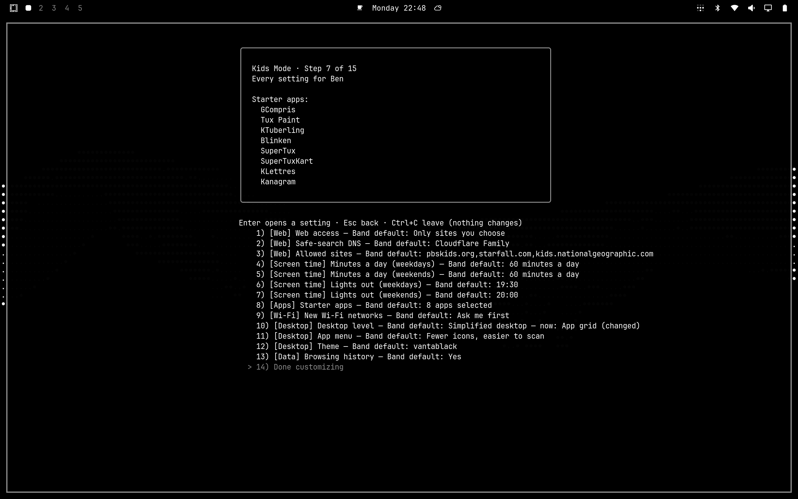

Desktop default restored. The summary again shows the Simplified desktop band default without an override marker.

Setup complete. The wizard reaches its final screen and states that final safety checks run at sign-in.

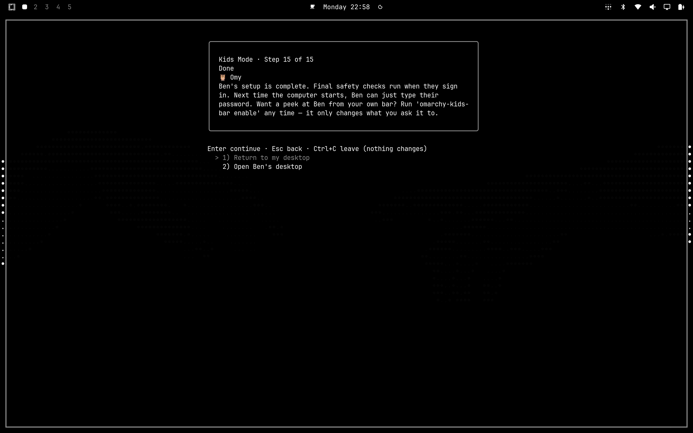

Real login portal. The Air’s SDDM portal shows square tile geometry under the parent’s Vantablack theme.

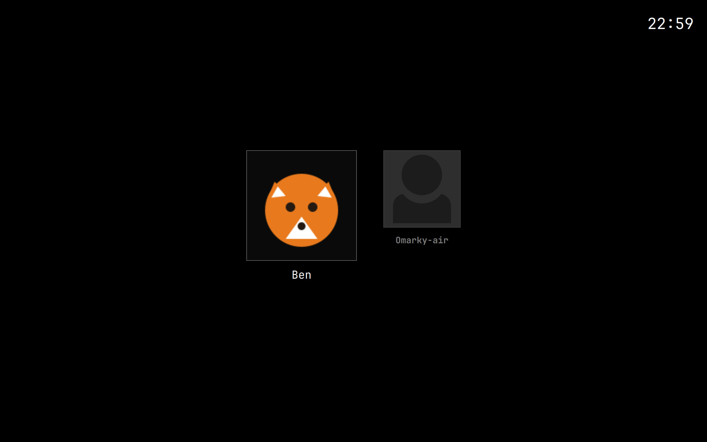

Empty login password field. The selected child tile and empty password field retain square corners. No password is shown.

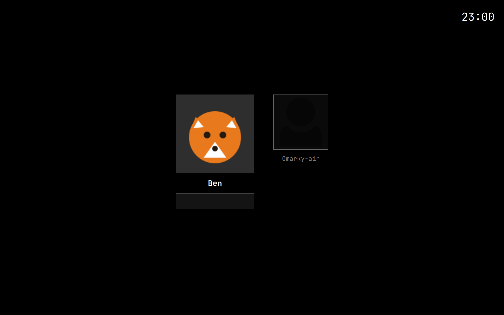

Simplified desktop. The child desktop shows the app-finding shortcut and keyboard help.

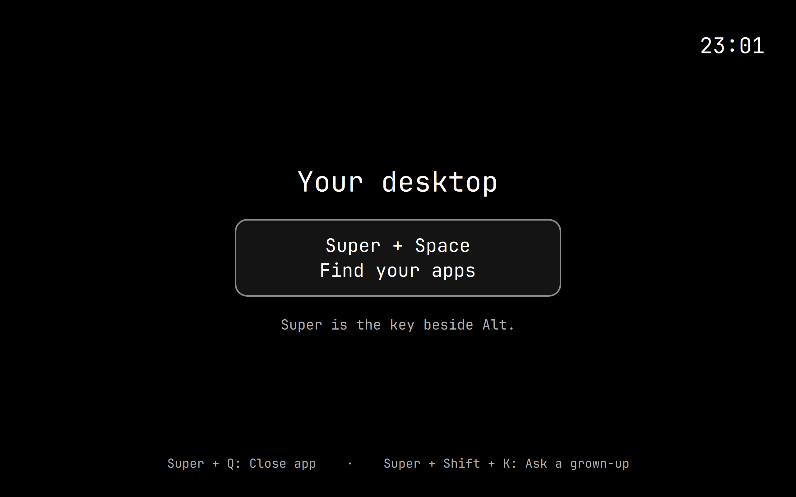

Two applications. Blinken and KTuberling are open side by side; this does not establish a completed activity.

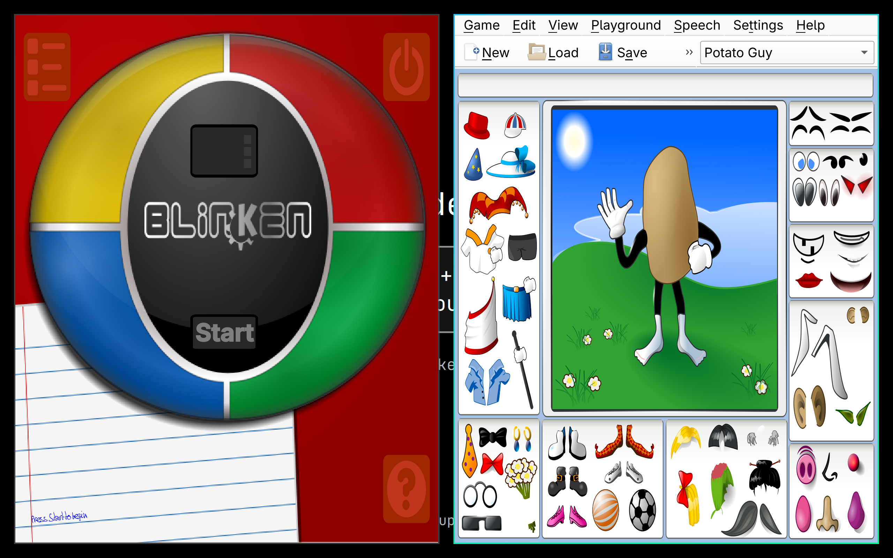

Picker opened through the binding. The existing Super+Space binding opened this picker with the temporary input setting described above.

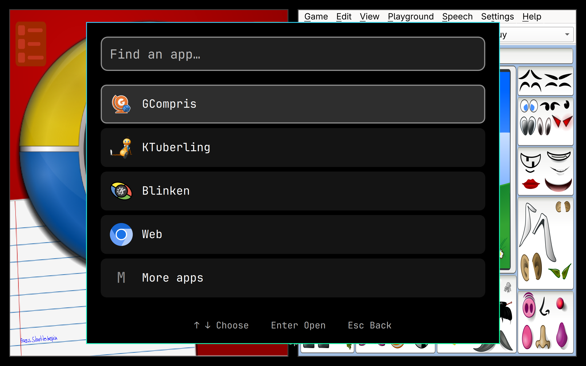

Ask for 15 minutes. The request dialog offers parent-present authentication and Ask later; its password field is empty.

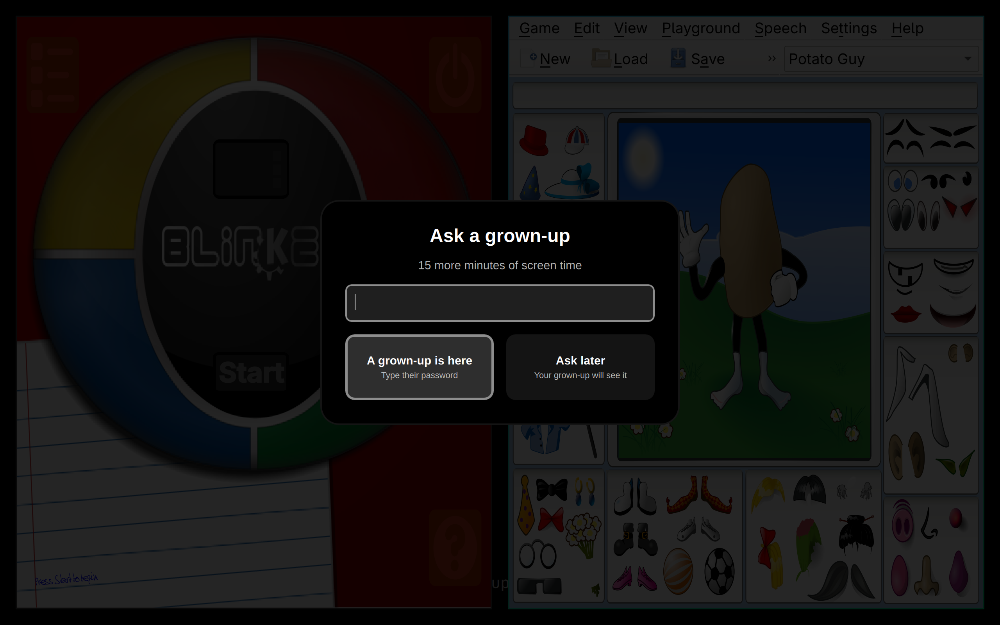

Ask later submitted. The dialog acknowledges submission. This image does not establish parent approval or a time grant.

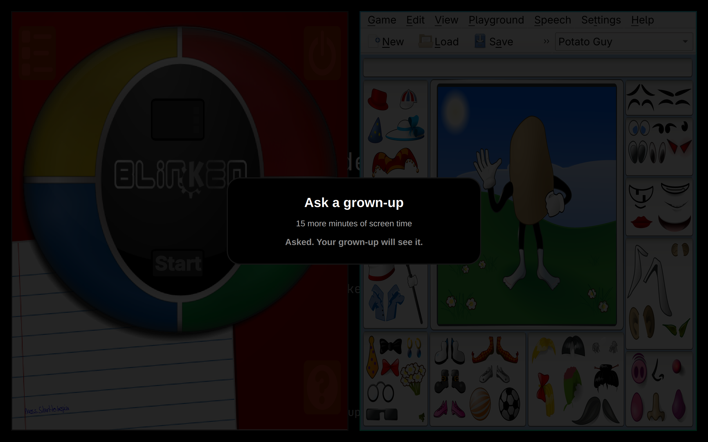

Finish returned to the portal. The live driver used the child’s Finish action and captured the returned SDDM portal.

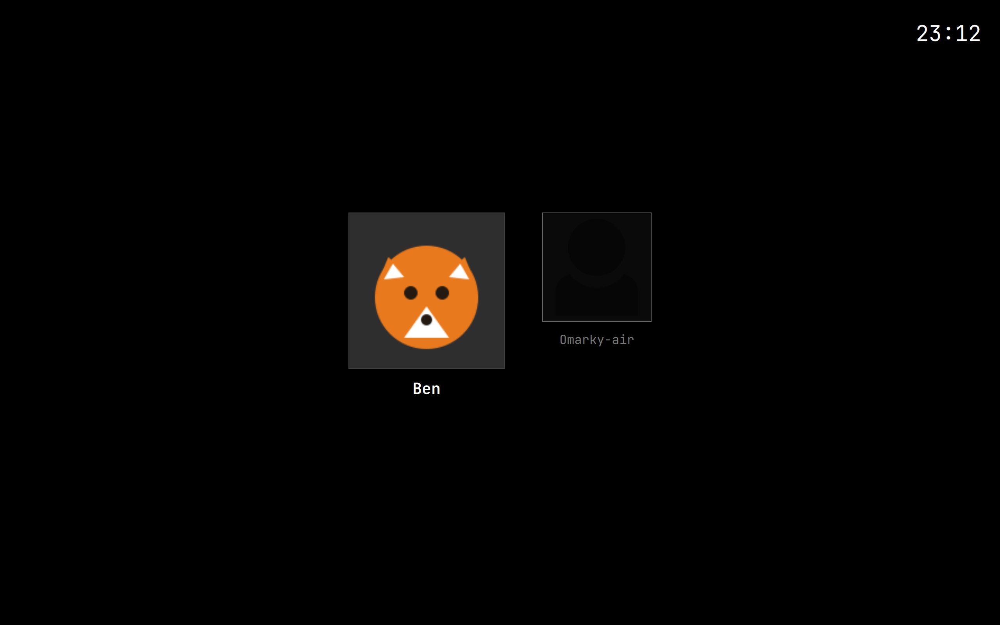
