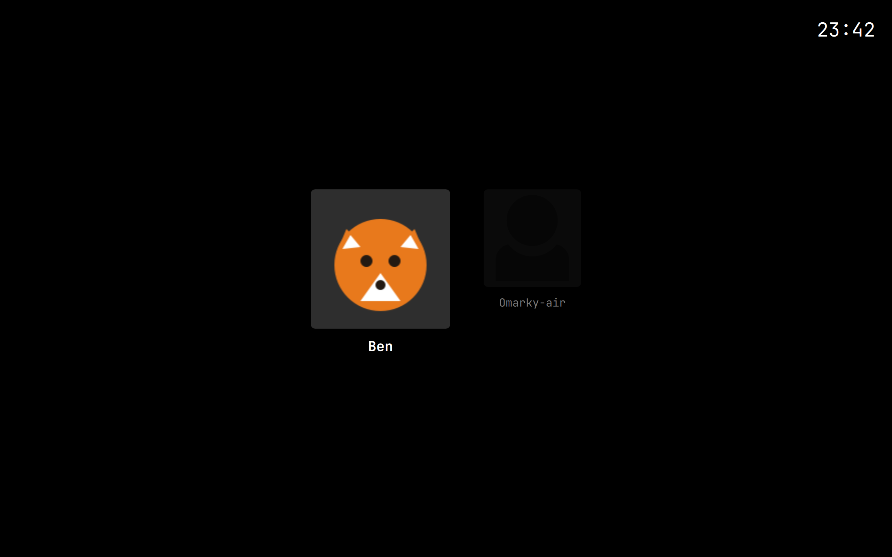
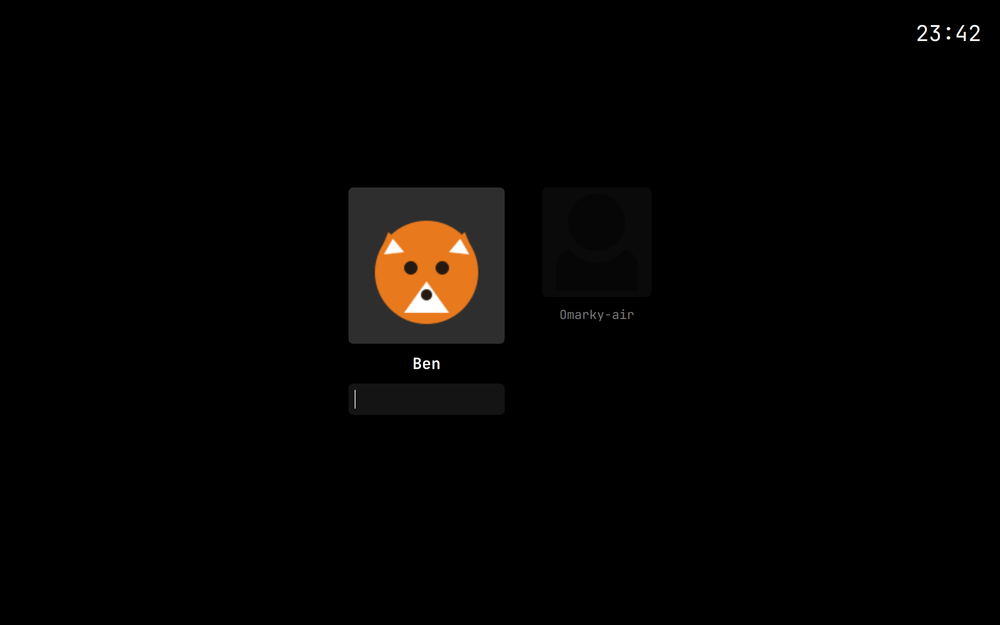
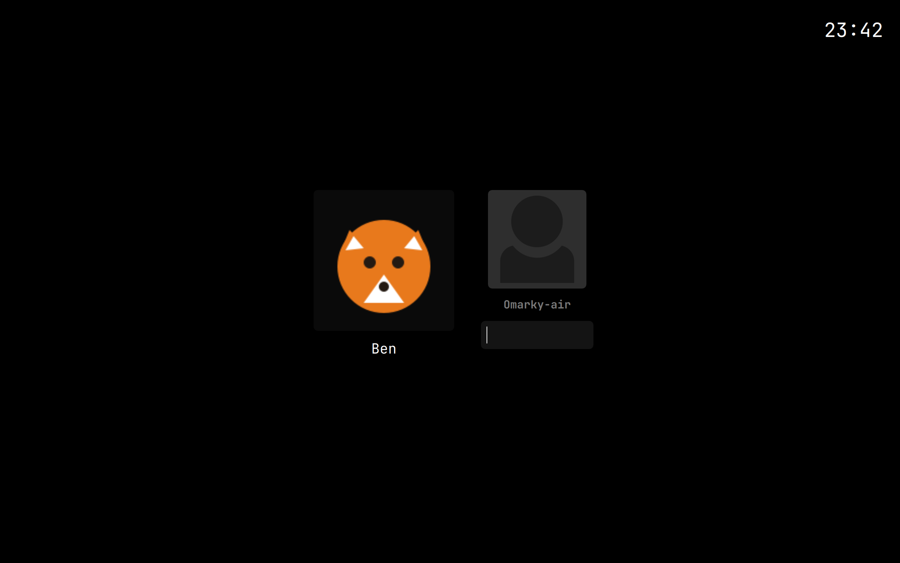

SDDM renderer acceptance for #201 on the Air. Three approved original PNGs, copied without alteration. Ben is the invented test child.

The installed package was built from `4d0703f`, SHA256 `a20feddcca8bd6c07b95fe6580c73cd49129be6585fc6186b7839834ed9660fb`, containing #201 from `476ef99`. The preview ran with `sddm-greeter-qt6 --test-mode` inside the parent session, using a parent-owned temporary copy of the installed theme. Only the fixture’s `cornerRadius=6` and `normalBorderWidth=0`, `selectedBorderWidth=0`, `focusBorderWidth=0` differed.

These images show rounded, borderless tiles and empty password fields, with selection retained through fill and bold text. They verify rendering of supplied geometry values, not export from a rounded parent theme or authentication. The actual square Vantablack login evidence is in the [separate gallery](../air200201-5c60118/README.md).

Selected child tile:

Empty child password field:

Selected parent tile and empty password field:

