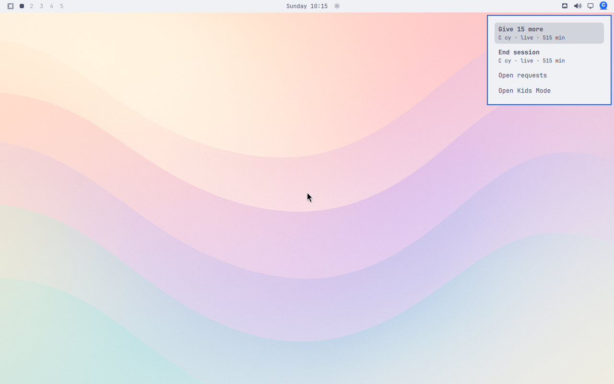

# Ledger check stopped on a journal message

Merged main `cfde6f2` produced this light-theme frame during the repeated real-ledger scenario. The menu is readable and shows 515 minutes. The harness then rejected a Quickshell journal entry before it could accept this frame or collect the next two updates. This run failed; the picture is not evidence of a complete light-theme pass.

Cause: the private named-scenario wrapper `bar-152-main-cfde6f2.sh`, `check_bar_journal`, line 333, passes `MESSAGE` directly into jq’s string matching operation. The collected Quickshell entries contain ANSI-colored messages represented as byte arrays. The string matcher errors on those arrays. This byte-array representation is documented in [systemd’s Journal JSON Format](https://systemd.io/JOURNAL_EXPORT_FORMATS/#journal-json-format). The checker must normalize supported journal representations and still reject malformed entries, excess records, and status-file permission failures.

The fixture profile is invented. No real child data or private journals are published. This is a capture-harness finding, not a visible defect in the displayed menu.
