# Merged-main bar: controlled status and keyboard checks

Main `cfde6f2` completed this controlled scenario in Tokyo Night and Catppuccin Latte. All 20 original frames passed visual review. Each theme kept the same Quickshell process across its ten captures. The capture, text, keyboard-input and cleanup checks passed. Separate restoration readback confirmed 181 package files with zero altered, original settings and themes, and the greeter without a child session.

These are controlled status fixtures. They do not prove real ledger updates, keyboard opening, or activation of the grant/end actions. Opening used IPC. An earlier attempt failed before its last two light-theme frames; its cause remains unknown. This successful retry retained diagnostic records through cleanup. The original failure remains recorded separately.

## tokyo-night

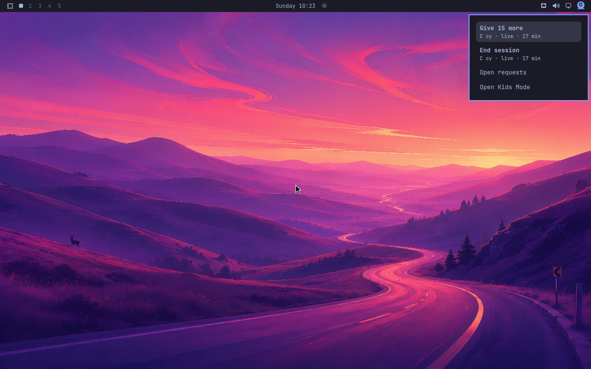

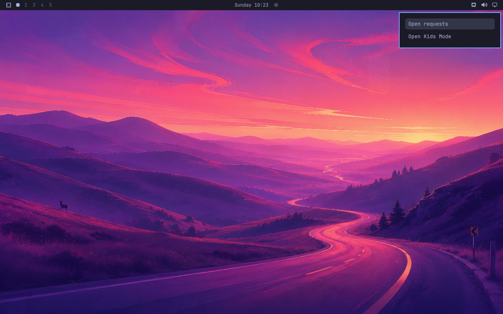

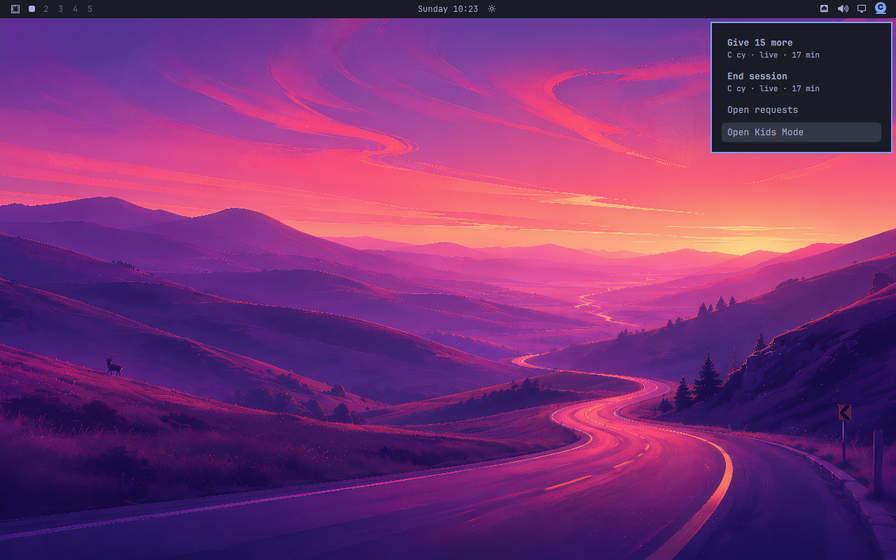

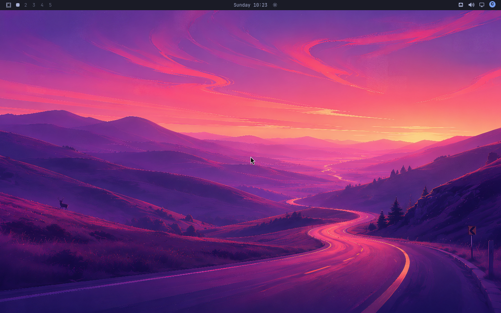

## catppuccin-latte

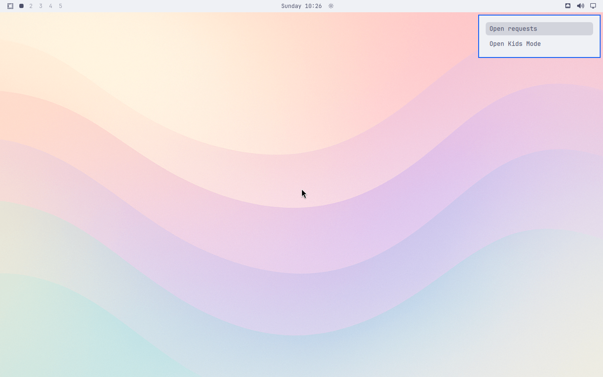

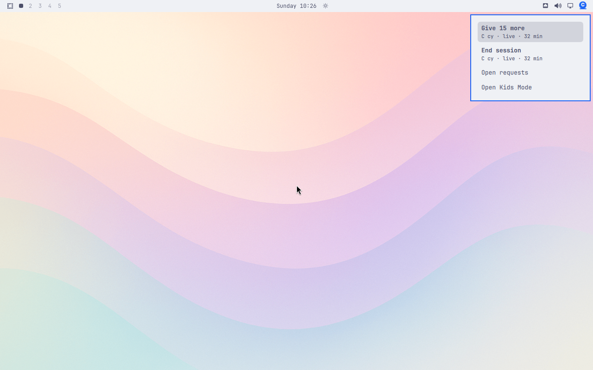

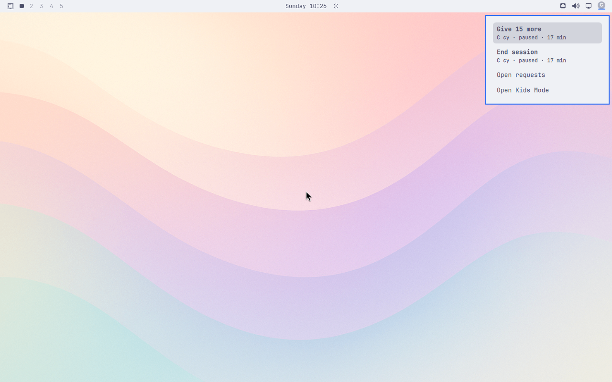

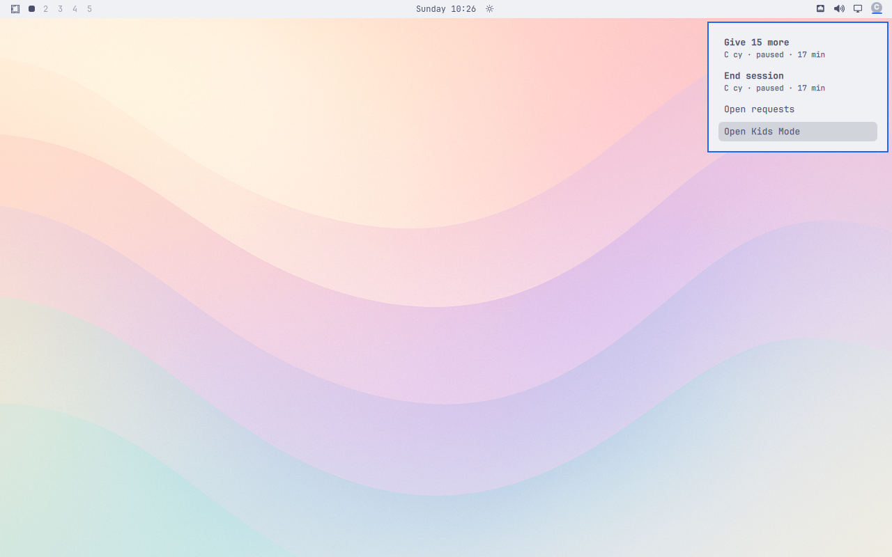

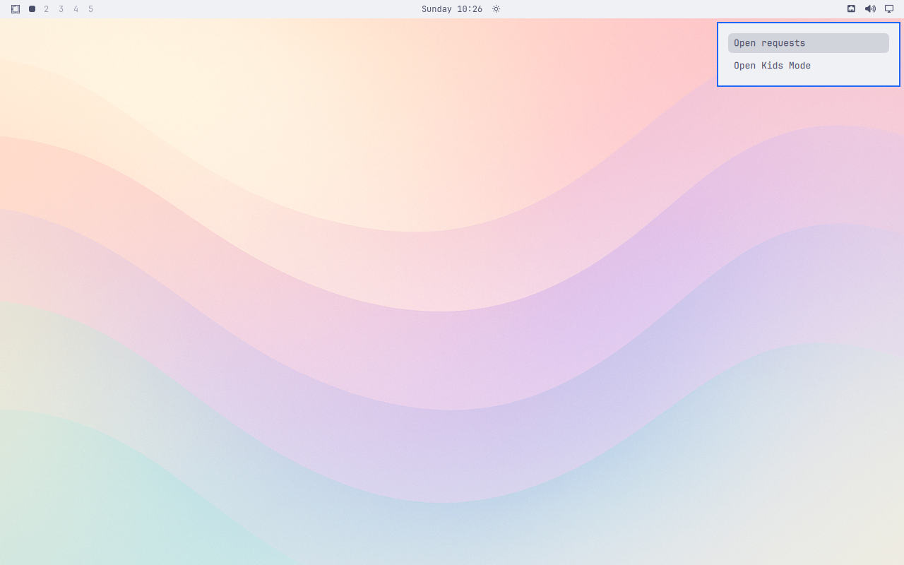

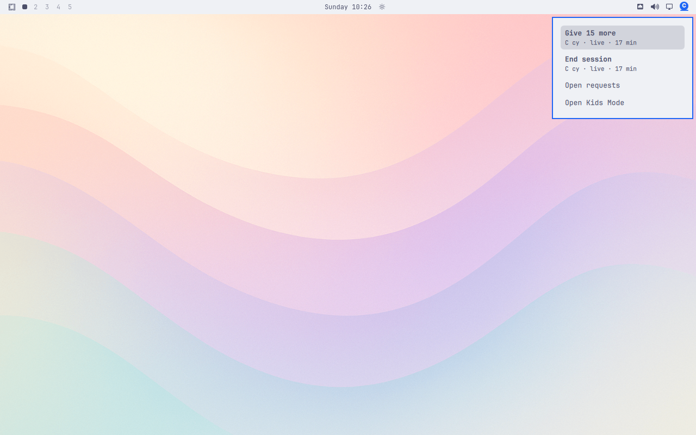

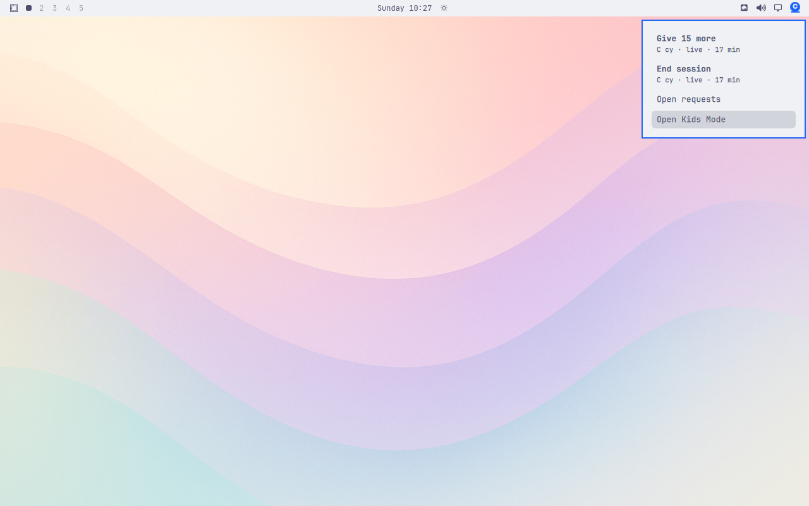

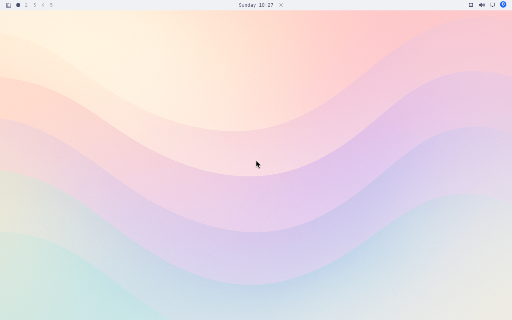

