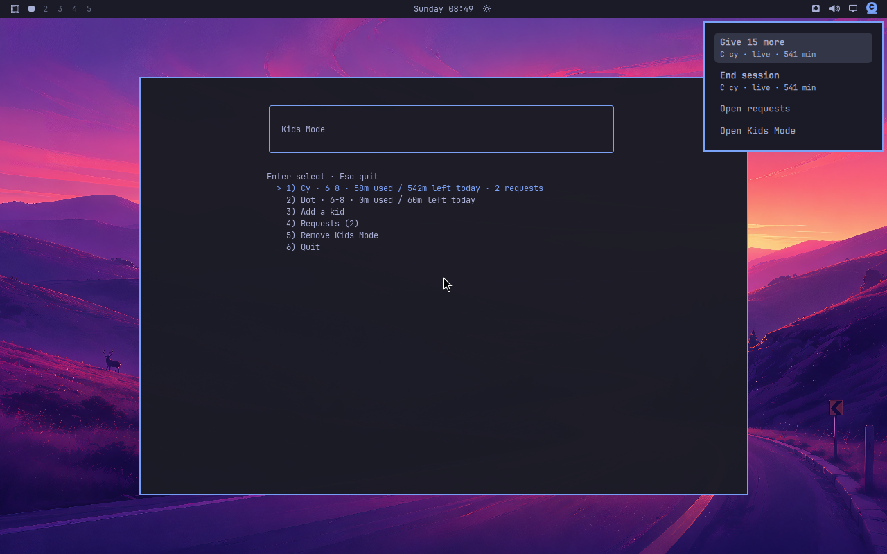

Parent-bar request count mismatch

Captured September 6, 2026 from the VM during the full media pass on public candidate bcd7cdee746c0fc45dc9c0238d0e4f8a25bec5a5. Packaged inputs match installed build 831d747. The screenshot contains invented test accounts only.

The parent panel shows two open requests. The bar menu says Open requests without a count, and the bar has no request-count badge. An ordinary-owner invocation of the same installed command used by the widget exited 1 with [root-only rejection](owner-query.log).

The widget invokes /usr/bin/omarchy-kids-ask list as the desktop user and treats empty stdout as zero requests. That command requires root before listing. This is a missing parent notification; the privileged request boundary is still enforced.

