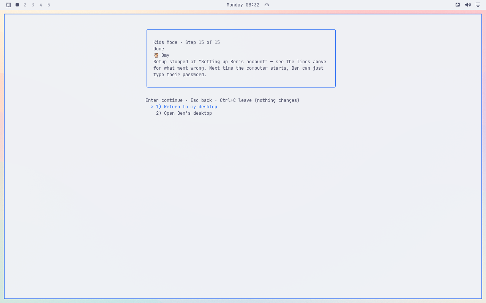
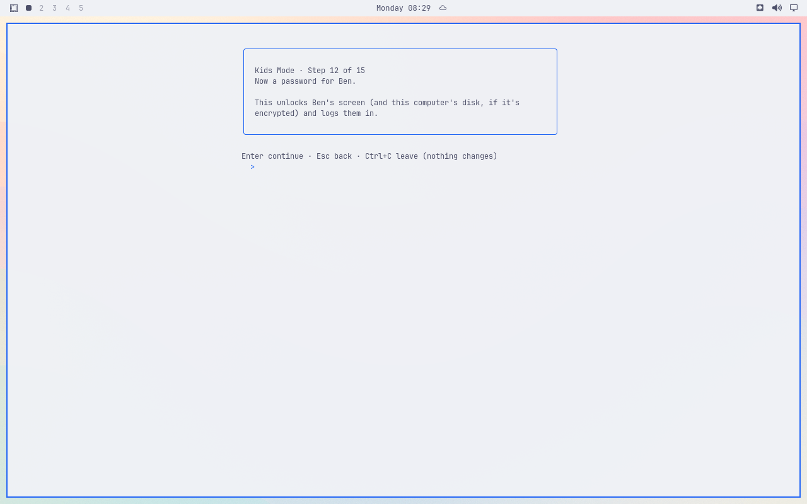

# Full setup stops in portal mode

Original installed VM screenshots from main `d291db1aad7022ac9d55bd8135cdb96fe553ad3e`, package SHA `3ab775e32033cd289e86d3c3bd93424f41036adabe38da1a6080ae087035a5fd`, Catppuccin Latte, 1280×800. Quickshell watching was verified after the fresh parent login. Only the invented Ben/Fox/Ages 6–8 fixture was used.

Real parent authentication, the default Simple choices, password confirmation, and Ready all worked. Apply was selected. Setup then stopped at account creation. The installed log reports `add: LUKS options are not available in portal mode`. A separate readback confirmed portal mode and that Ben's account, home, and profile were absent.

The wizard always sends `--parent-password-stdin` for a password-protected child at `lib/wizard-apply.sh:40–42`. The authoritative provisioner rejects this disk-only option in portal mode at `lib/provision-add.sh:70–73`.

The failure screen also says Ben can log in next time and offers Open Ben's desktop, although no account exists. It refers to error lines that the visible card no longer shows. These claims come from `lib/wizard-apply.sh:189–200`; the unconditional login sentence is line191.

Earlier, the password screen promised the child's password unlocks an encrypted disk, despite the confirmed portal mode. That unconditional description is `lib/wizard-screens.sh:289`. Portal mode does not enroll a child disk-unlock key. This is a separate wording issue from #109's package-install boot-image rebuild hold. No password has been entered in this frame.

These are observed failures, not acceptance evidence for a fix. The full setup attempt returned to the parent desktop. The protected original VM snapshot and separate UEFI backup remain retained for final restoration.
