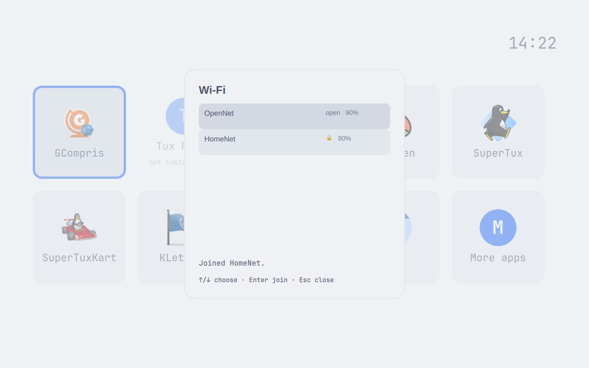

# Wi-Fi confirmation through refresh

Installed candidate `73ccace18ec30ce48ea252f64ac59b581376b78f` for #148, captured on the real VM in Tokyo Night and Catppuccin Latte. All 26 original frames were inspected by the driver and an independent reviewer. The controlled join client uses invented networks and a test password; this is UI proof, not real wireless association or NetworkManager authorization.

The joined-network message remains visible during the automatic refresh and after OpenNet moves above HomeNet. Manual retry and a new join replace old feedback. A failed refresh replaces success with the scan error. Repeated Enter during the held refresh produced one join and one refresh in each theme. Pointer retry, keyboard retry, arrows, Enter, Escape, and password clearing were exercised.

The open-network password guidance shown in the failure frames is the separately filed [#164](https://github.com/markcuda/omarchy-kids-sandbox/issues/164). The missing background app is existing #91.

The ordered source gate passed: formatter, 40 Mac files, 40 VM files, and named scenario 05. The Mac suite reported five platform skips; the VM suite reported two, with its live authentication and Wi-Fi peer-identity checks executed. The installed interaction run exited zero. Separate final restoration readback also passed: 181 package files with zero altered, original Wi-Fi bytes/ownership/mode/timestamp, original themes and time/Wi-Fi settings, active timer, collected test unit, greeter only, and no recovery receipts or temporary live configuration.

| State | Tokyo Night | Catppuccin Latte |
| --- | --- | --- |
| Empty list | [Original](wifi148-dark-empty.png) | [Original](wifi148-light-empty.png) |
| Scan error | [Original](wifi148-dark-scan-error.png) | [Original](wifi148-light-scan-error.png) |
| Networks after pointer retry | [Original](wifi148-dark-networks.png) | [Original](wifi148-light-networks.png) |
| Joined HomeNet during refresh | [Original](wifi148-dark-joined-refreshing.png) | [Original](wifi148-light-joined-refreshing.png) |
| Joined HomeNet after reordering | [Original](wifi148-dark-joined-reordered.png) | [Original](wifi148-light-joined-reordered.png) |
| Open-network failure (#164) | [Original](wifi148-dark-open-failure.png) | [Original](wifi148-light-open-failure.png) |
| Open-network success after empty refresh | [Original](wifi148-dark-open-success-empty.png) | [Original](wifi148-light-open-success-empty.png) |
| Manual retry clears success | [Original](wifi148-dark-manual-retry-clears.png) | [Original](wifi148-light-manual-retry-clears.png) |
| Failed refresh replaces success | [Original](wifi148-dark-refresh-failure.png) | [Original](wifi148-light-refresh-failure.png) |
| Masked test password | [Original](wifi148-dark-password-typed.png) | [Original](wifi148-light-password-typed.png) |
| Password empty after Escape and reopening | [Original](wifi148-dark-password-reopened-empty.png) | [Original](wifi148-light-password-reopened-empty.png) |
| Arrow selection | [Original](wifi148-dark-arrow-selection.png) | [Original](wifi148-light-arrow-selection.png) |

Additional light-theme frames: [new join replaces old success](wifi148-light-new-join-clears.png), [submitted OpenNet success after reordered refresh](wifi148-light-open-success-reordered.png).

