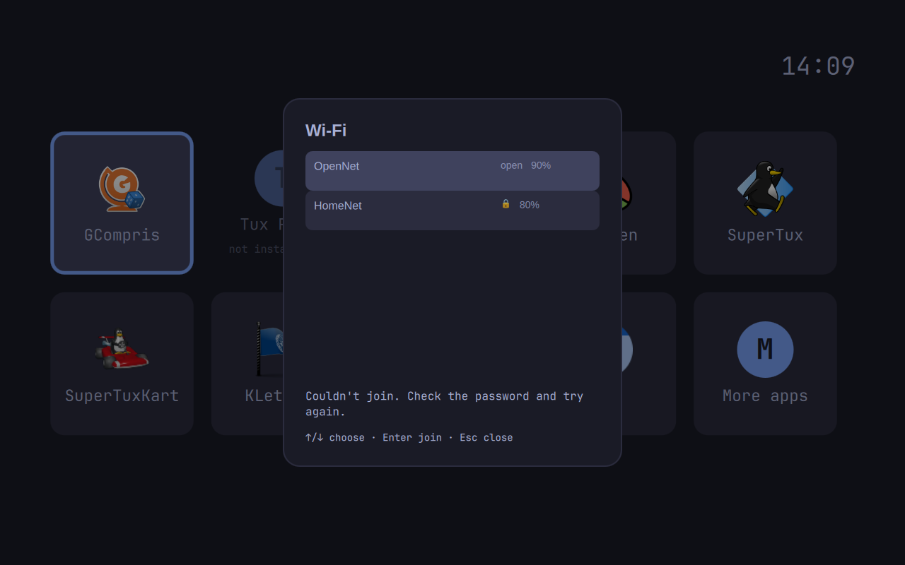

# Open-network failure guidance

Real VM screenshot of the installed Wi-Fi picker at candidate `73ccace18ec30ce48ea252f64ac59b581376b78f`, in Tokyo Night. The selected invented network is explicitly open, but the failure asks the child to check a password.

The controlled join client recorded zero password bytes and a failed open-network join. No automatic refresh followed. This proves the UI error wording; it does not prove a real wireless association or NetworkManager policy. The screenshot was inspected independently. The complete candidate interaction pass is still in progress.

The generic join-error branch in `share/wifi/shell.qml:154` supplies this password-specific message for open and protected networks alike.
