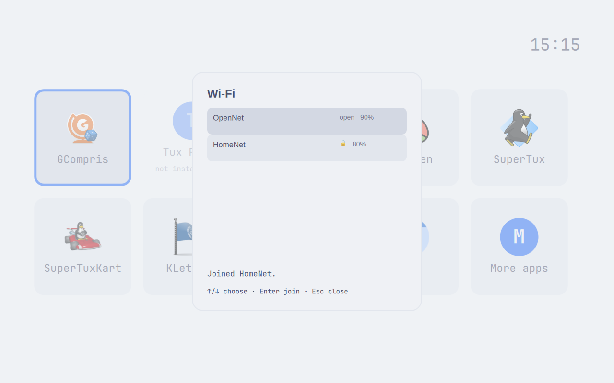

# Merged-main Wi-Fi confirmation

Merged main `441ab320f428e02e1c4bd98d7d4183002aa19b84` has the identical tree to installed candidate `73ccace18ec30ce48ea252f64ac59b581376b78f`. This fresh postmerge run repeats the #148 confirmation transitions in Catppuccin Latte and Tokyo Night. The driver and an independent session inspected all 14 original screenshots. Only invented networks and a fixture password are used; the controlled client does not prove real wireless association or NetworkManager authorization.

The merged-main test-box formatter, 40-file Mac suite, 40-file VM suite, and named scenario 05 passed in order. Mac reported five platform skips; VM reported two and executed its authentication and peer-identity checks. The installed interaction run and a separate restoration readback exited zero. All 181 package files were intact, exact Wi-Fi bytes/ownership/mode/timestamp and original settings/themes were restored, the timer was active, the owned session was collected, and the VM was at the greeter with no temporary receipts or live configuration.

The fixture recorded 42 action rows: six joins, all successful, and fourteen scans, including the two deliberate scan failures. Four protected joins received the expected fixture line and EOF; two open joins received zero stdin bytes. No hold timed out. The [earlier 26-frame candidate run](../wifi-148-73ccace/README.md) separately covers duplicate Enter, busy states, arrows, password masking/clearing, and Escape. This repeat does not claim those broader checks again. The missing background app remains #91.

| State | Tokyo Night | Catppuccin Latte |
| --- | --- | --- |
| Empty list | [Original](wifi148-main-dark-empty.png) | [Original](wifi148-main-light-empty.png) |
| Joined HomeNet during refresh | [Original](wifi148-main-dark-joined-refreshing.png) | [Original](wifi148-main-light-joined-refreshing.png) |
| HomeNet confirmation after OpenNet-first reordering | [Original](wifi148-main-dark-joined-reordered.png) | [Original](wifi148-main-light-joined-reordered.png) |
| New OpenNet join clears prior confirmation | [Original](wifi148-main-dark-new-join-clears.png) | [Original](wifi148-main-light-new-join-clears.png) |
| OpenNet success after empty refresh | [Original](wifi148-main-dark-open-success-empty.png) | [Original](wifi148-main-light-open-success-empty.png) |
| Pointer retry clears prior confirmation | [Original](wifi148-main-dark-manual-retry-clears.png) | [Original](wifi148-main-light-manual-retry-clears.png) |
| Failed refresh replaces success | [Original](wifi148-main-dark-refresh-failure.png) | [Original](wifi148-main-light-refresh-failure.png) |

