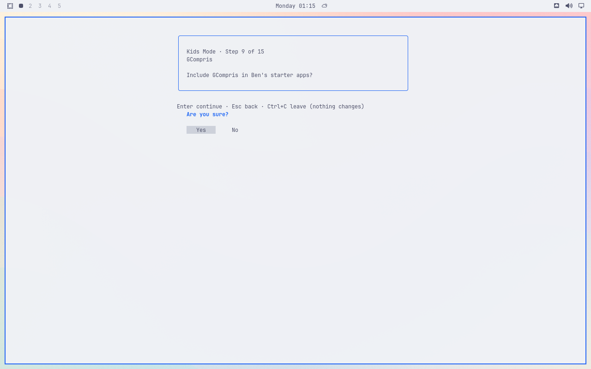

# Duplicate confirmation question

Original installed VM screenshot at source `7482d1cfa1b9e4244e994679f06e814dbbe3f02b`, Latte theme, Simple dry-run preview with the invented Ben fixture. The card asks whether to include GCompris; a second “Are you sure?” question appears below the navigation footer. This is separate from #180’s app-picker input fix. No settings were applied.

