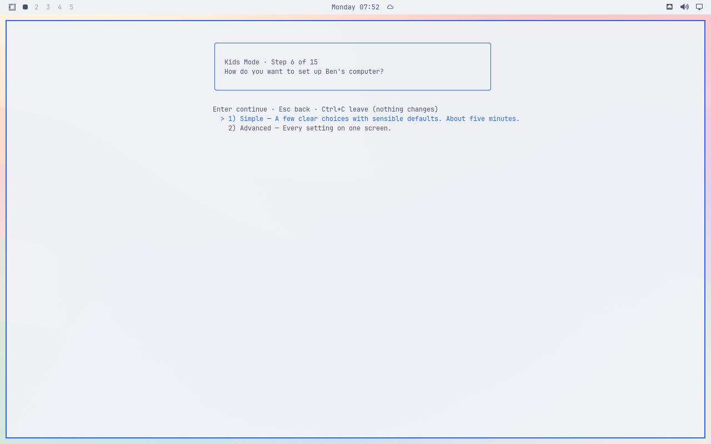
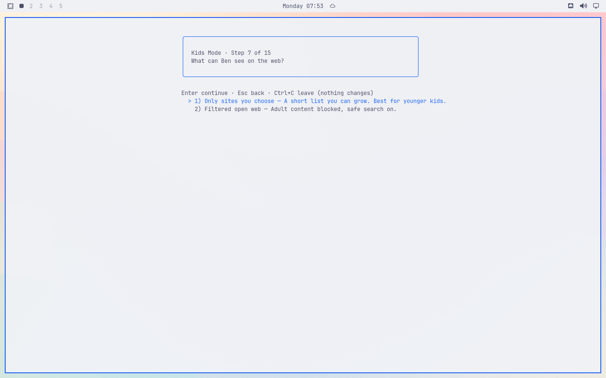

# Setup stops responding after choosing an age

Original installed VM screenshots from main `6fa6d30329ad400dd8076ce22ab08490e5158ca4`, Catppuccin Latte, 1280×800. Real setup used the invented Ben/Fox/Ages 6–8 fixture. Parent authentication succeeded. No resize occurred. Apply was never selected.

After Age, the Simple/Advanced page has broken borders and literal terminal-control text. One Enter does not advance: the page remains, with stale text remaining and Advanced selected. A read-only process/terminal check found Gum running while the terminal was in canonical mode with echo and CR-to-LF translation enabled.

A second real setup reproduced the corruption. A read-only observer saw the prefetch sudo process inherit the wizard terminal and restore cooked terminal flags when it exited, while the same Gum process remained open. The responsible command is `bin/omarchy-kids-wizard:208`, started after Age by `lib/wizard-screens.sh:104–105`. This differs from #120, which requires a resize.

## Verified fix

Candidate `11383c8e09f71ce67a33e28930203241460af9ef` explicitly gives prefetch stdin `/dev/null`. On the installed VM, the same authenticated Ben/Fox/Ages 6–8 route left Mode clean after the real prefetch processes disappeared. Enter on Simple advanced to Web. The observer identified the real sudo/pacman commands, verified `/dev/null` on stdin, and showed the same Gum process retaining raw terminal flags. Prefetch exit status was not observed.

Ctrl+C opened Leave confirmation; Enter on Yes closed setup. Apply was never selected. Ben's account, home, and profile remained absent. The owned processes were gone, the parent returned to the greeter, and separate package/settings checks passed. Quickshell watching was verified in the fresh parent session.

