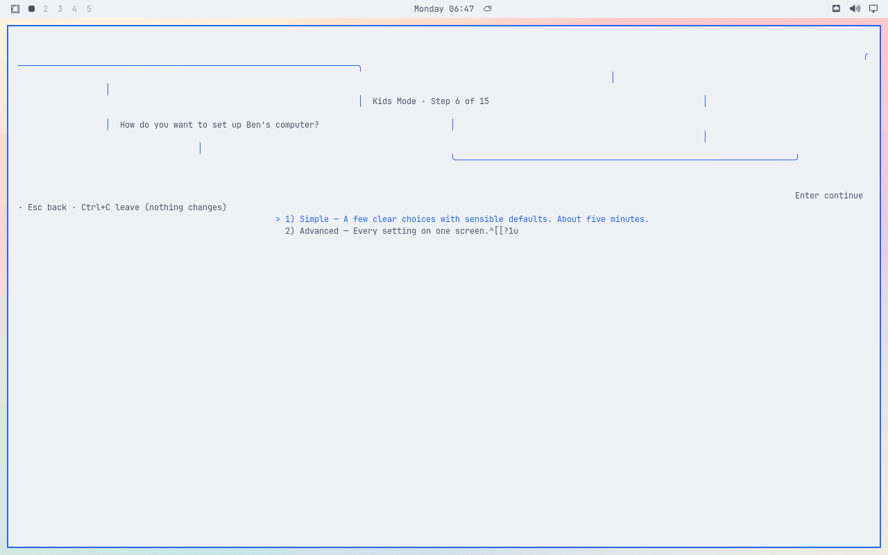
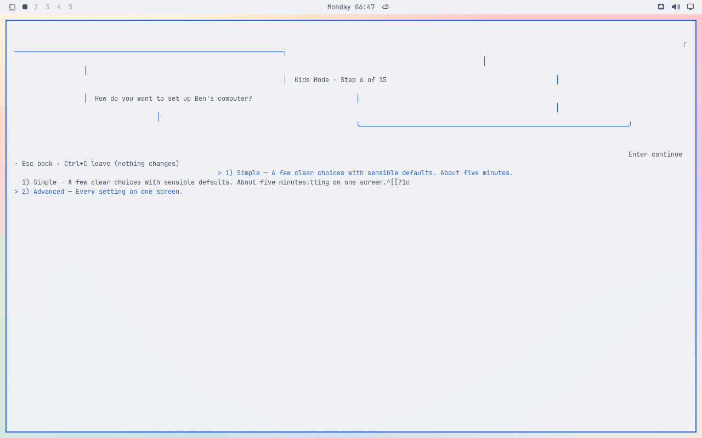

# Setup stops responding after choosing an age

Original installed VM screenshots from main `6fa6d30329ad400dd8076ce22ab08490e5158ca4`, Catppuccin Latte, 1280×800. Real setup used the invented Ben/Fox/Ages 6–8 fixture. Parent authentication succeeded. No resize occurred. Apply was never selected.

After Age, the Simple/Advanced page has broken borders and literal terminal-control text. One Enter does not advance: the page remains, with stale text remaining and Advanced selected. A read-only process/terminal check found Gum running while the terminal was in canonical mode with echo and CR-to-LF translation enabled.

The suspected source is the background prefetch started by `lib/wizard-screens.sh:104–105`, launched at `bin/omarchy-kids-wizard:207–209` as a background sudo command sharing the terminal session. This is a hypothesis pending a controlled comparison. The sudo keeper remains a competing explanation. This differs from #120, which requires a resize.

