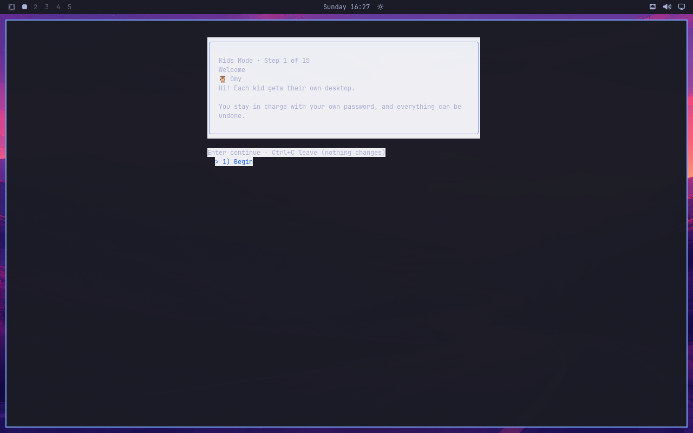

# Additional stale-color reproduction — #111

Installed VM source `4fba8f4`, Gum 2.0.0. Switching the parent theme from Catppuccin Latte to Tokyo Night inside the same session, then opening an owned Foot dry-run wizard through the user service manager, produced Tokyo foreground text on a retained Latte background. The original screenshot below contains no typed password.

The wizard process and user service manager retained `BACKGROUND=#eff1f5` and Latte Gum color variables; the current theme file resolved Tokyo colors. `lib/tui.sh:51` preserves already-exported Gum variables while the card uses freshly resolved foreground colors. This reproduces existing issue #111 through a direct test launcher; it is not evidence that the pending launcher fix has been installed. A fresh graphical login produced consistent Tokyo colors. No stored theme workaround is proposed as the product fix.
