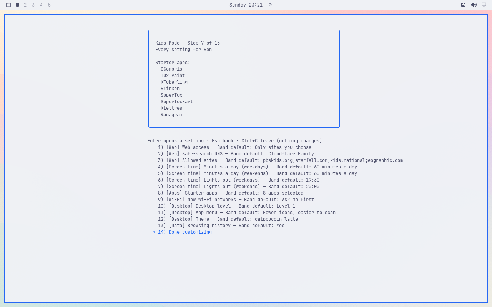
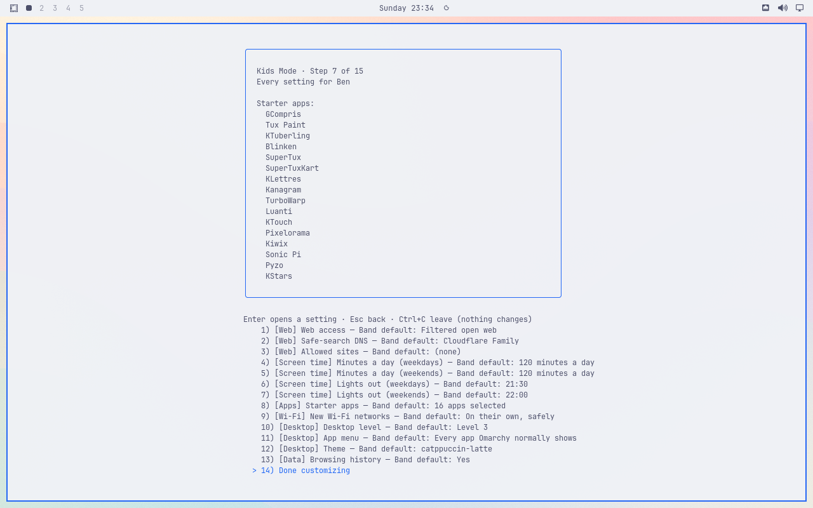
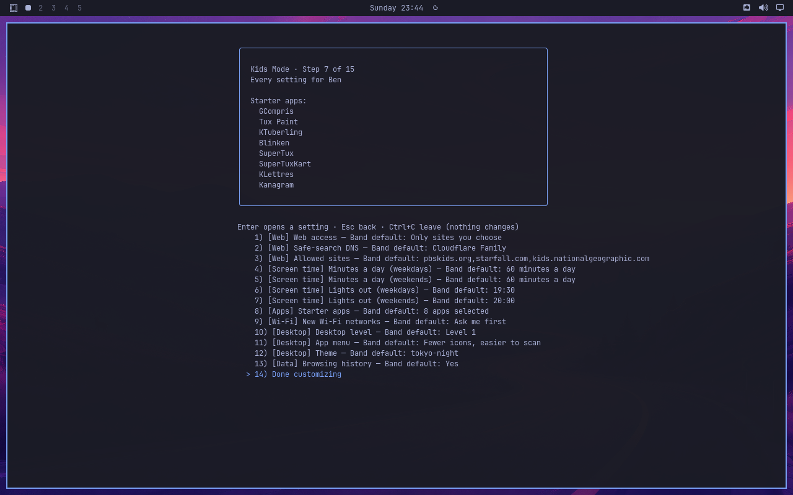
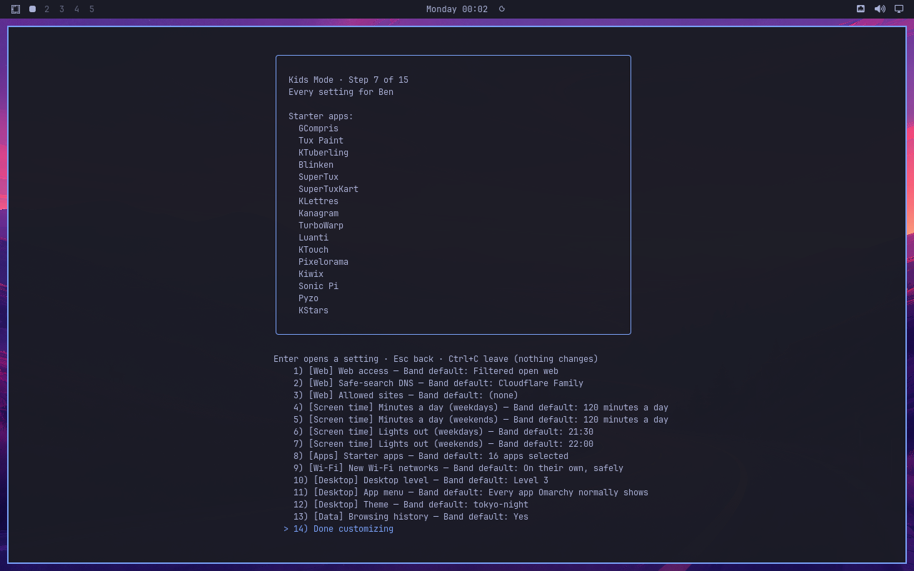
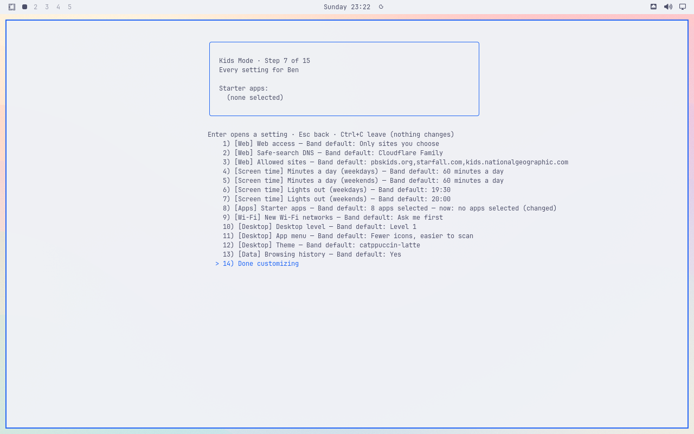
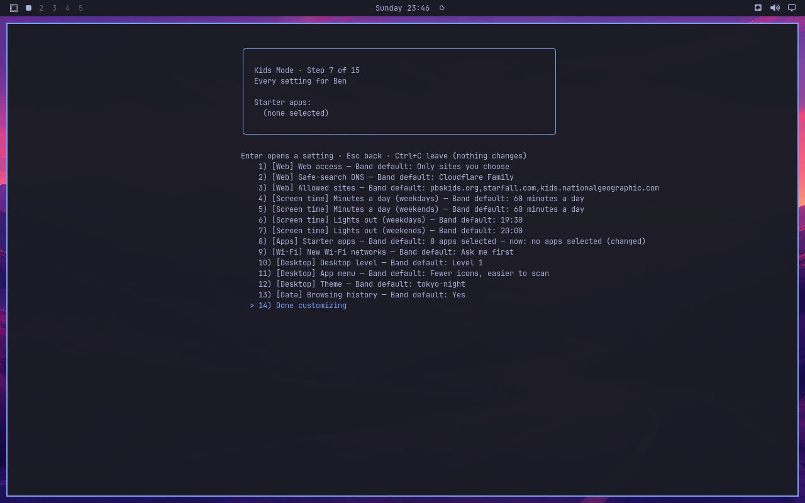
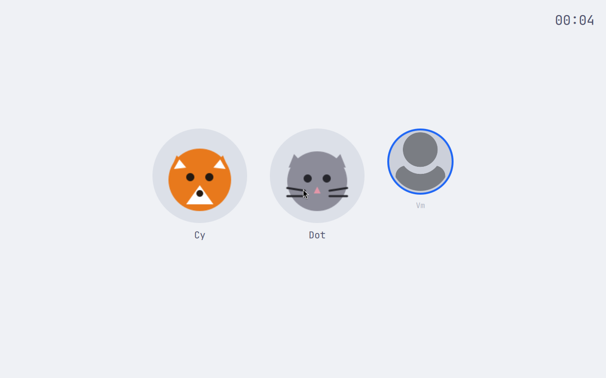

# Advanced starter-app list: candidate rendering and editing blocker

Candidate `447c79b8b8baa937f7317d7abc3813b0efbcaaab`, PR #173, remains unmerged. The eight- and sixteen-app lists fit in both themes, including all checklist rows and Done. Editing acceptance failed: opening Starter apps cleared all selections without showing prompts, the preexisting bug now tracked in [#180](https://github.com/markcuda/omarchy-kids-sandbox/issues/180). No complete live pass is claimed for #172.

These are seven unmodified QMP screenshots from the installed package `1bbacfee67fa7ab3c5525cf8a71cefc5cf4ad9c26a3ce645eba9caf4da76b5a6`, at 1280×800 with a 1256×750 Foot window. Each theme used a fresh parent login with Quickshell watching enabled and verified. Ben is an invented preview fixture; no Apply or provisioning occurred.

The source formatter, 43-file Mac suite (five skipped checks), 43-file VM suite (two skipped checks), and live scenario 05 passed before installation. The four preview units and their children, plus both watcher/supervisor pairs, were verified gone. The original Latte greeter and settings were restored; the separate installed readback passed package integrity (181 files, zero altered), pinned files, themes, settings, timer, and greeter-only state. That readback initially could not start because the Mac was out of space; it passed after verified project storage relocation. Rendering and failure keyframes passed independent visual review.

## Latte: all eight app labels and the full checklist fit.

## Latte: the settled sixteen-app rendering fits, including Done.

## Tokyo: all eight app labels and the full checklist fit.

## Tokyo: all sixteen app labels and the full checklist fit.

## Latte editing failure: no app prompt appeared; selection became empty. The original filename is retained.

## Tokyo editing failure: opening Starter apps again produced an empty selection.

## Original Latte greeter restored. The separate readback later passed.

