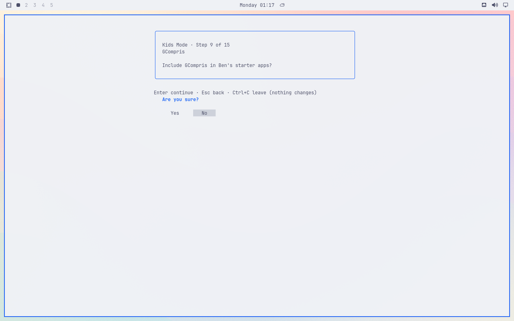
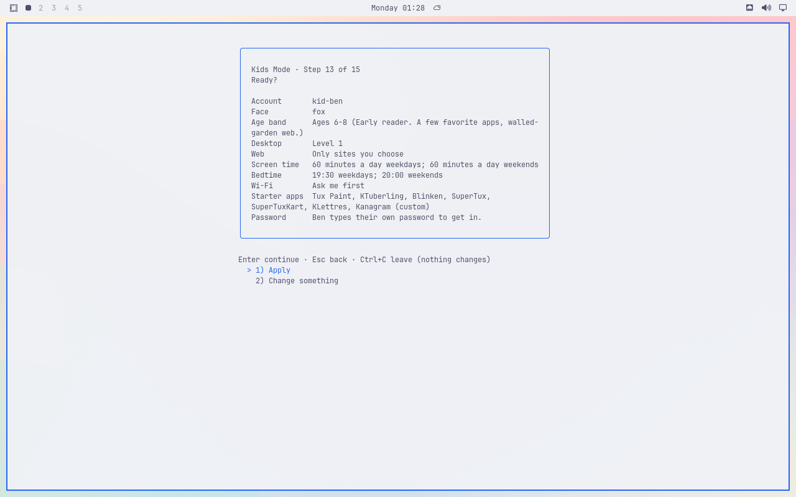
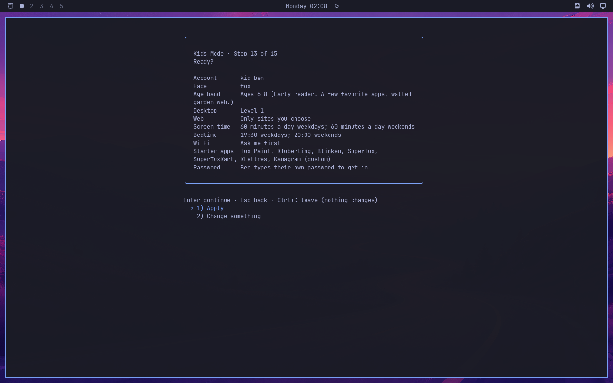
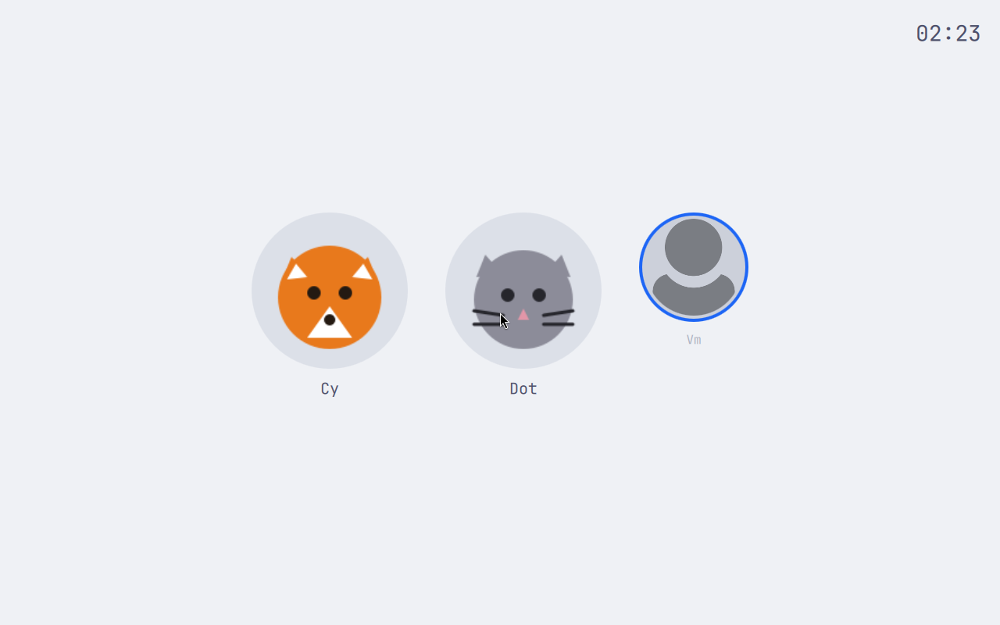

# App-picker acceptance before merge

Installed VM source `7482d1cfa1b9e4244e994679f06e814dbbe3f02b`, package SHA-256 `dda1a2815fca224b8fc43815bded804fbe840c6f73a6b4e31966ab6d222b9d68`. These original screenshots are premerge evidence for #180, captured September 7, 2026.

Each Simple and Advanced dry-run route selected GCompris **No** and the other seven apps **Yes**. Each Ready screen retained exactly Tux Paint, KTuberling, Blinken, SuperTux, SuperTuxKart, KLettres, and Kanagram. The invented Ben fixture was never applied or created. This verifies app selection and preview, not provisioning or the full parent setup journey.

Quickshell watching was enabled and its actual process identity checked after each fresh parent login. No edit-triggered reload was tested. Independent visual review passed for all four routes.

All four preview units and their eight processes were closed. Both temporary watcher process pairs were gone, and the VM returned to its original Latte greeter with Ben absent. The image proves the greeter view; process and account absence were checked separately.

Known Advanced checklist clipping remains #172; the redundant confirmation question remains #182. Partial redraw captures and two idle focus interruptions were retained privately as diagnostics and were not treated as product failures or acceptance images.
